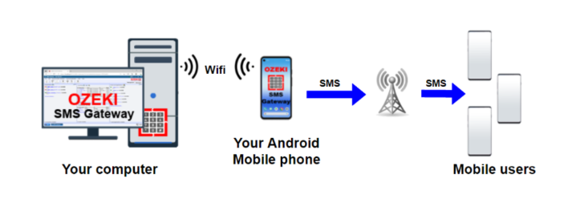
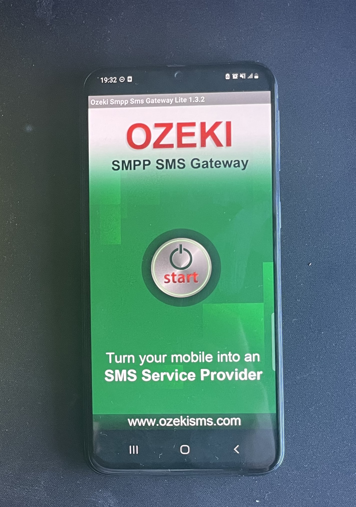
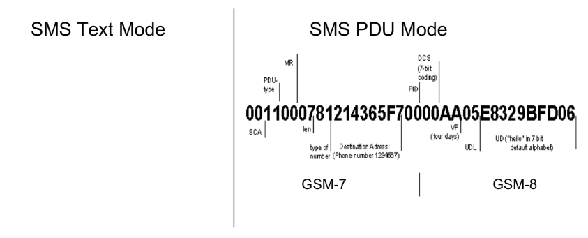
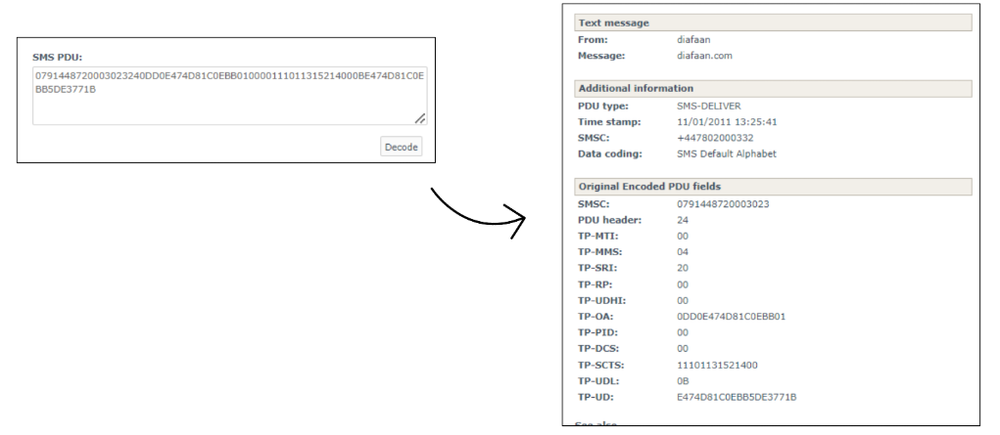
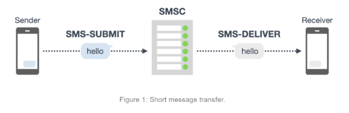
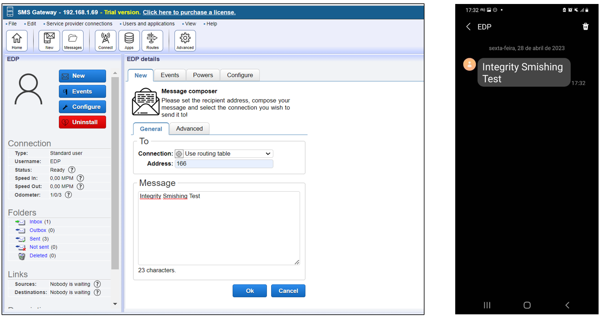
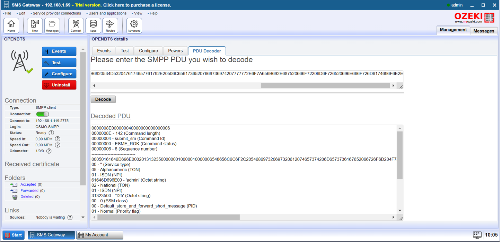

# Overview of SMS Gateway and Ozeki 10 SMS Gateway

During my project of [building a 2G network](2G-Network.md), I came across the Ozeki 10 SMS Gateway. This software not only serves as a powerful SMS management tool but also provides flexibility by allowing installation on an Android device while being controlled from a Windows machine. This feature enables seamless integration and efficient message routing within a network.

## What is an SMS Gateway?

An SMS Gateway is a system that allows messages to be sent and received between a computer or server and mobile devices. It acts as an intermediary, translating messages from different protocols into a format compatible with mobile networks. Businesses and individuals use SMS gateways for bulk messaging, alerts, authentication, and communication automation.

### Ozeki 10 SMS Gateway Advantages

Ozeki 10 stands out due to its ability to install the SMS server on an Android device while enabling remote control from a Windows machine. This feature enhances mobility, reduces hardware dependency, and simplifies deployment.

## SMS Text Mode vs. SMS PDU Mode

There are two primary modes for sending SMS. SMS Text Mode uses a human-readable format, simplifying message sending but limiting customization. [SMS PDU Mode (Protocol Data Unit)](https://www.diafaan.com/sms-tutorials/gsm-modem-tutorial/online-sms-pdu-decoder/) provides greater control over message encoding, allowing binary SMS, special character sets (GSM-7, GSM-8), and message concatenation. See more [here](https://ozeki-sms-gateway.com/p_313-sms-protocol-explained.html).

### Understanding Key SMS Message Types

Several message types exist within the SMS protocol, each serving a different function. The **SMS-DELIVER** message is used by the network to deliver a message to a recipient, while the **SMS-DELIVER-REPORT** is sent as a response to confirm message reception. The **SMS-SUBMIT** message is used by a mobile device to send an SMS to the network, and the **SMS-SUBMIT-REPORT** acknowledges the submission of that SMS. Additionally, the **SMS-STATUS-REPORT** provides information about the status of a previously sent message. The **SMS-COMMAND** message is used for special commands such as message deletion or service requests.

### Security Concerns: Binary SMS Exploits

Binary SMS messages, which allow for extended functionalities, have been exploited for security attacks. A notable example discussed in this [article](https://www.securitynewspaper.com/2016/07/27/binary-sms-old-backdoor-new-thing/) describes how malicious SMS messages can be crafted to exploit vulnerabilities in mobile networks and devices. Attackers can use binary SMS to send silent messages, execute remote commands, or even compromise devices. Many attacks can be carried out, I recommend this [blog](https://akaki.io/2022/transmission_and_detection_of_silent_sms_in_android) which contains very funny attacks to reproduce.

## Implementing an SMS Gateway

Setting up an SMS gateway involves several steps. First, Ozeki 10 SMS Gateway must be installed on an Android device. Once installed, it must be configured to work with a Windows machine for remote management. The next step is defining routing rules and message processing workflows to ensure efficient message transmission. Lastly, security best practices must be implemented to prevent unauthorized access, such as restricting access to the gateway, using encryption where possible, and monitoring logs for suspicious activity.

### SMS Spoofing and Security Threats

Another concerning vulnerability is SMS spoofing, where attackers manipulate the sender ID to impersonate trusted entities. A case study in this [article](https://akaki.io/2022/analysis_and_reproduction_of_spoofed_sms-deliver) details how spoofed SMS messages can be used for phishing attacks, fraud, and social engineering.

## Current and Legacy SMS Vulnerabilities

SMS has been a target of various attacks over the years. One of the most well-known vulnerabilities is interception via **SS7 protocol exploits**, which allows attackers to eavesdrop on messages and calls. **SIM swapping attacks** involve fraudsters tricking mobile carriers into transferring a victim's phone number to a new SIM card, enabling them to intercept authentication codes and take over accounts. **Silent SMS tracking** is another concern, where special SMS messages are sent without notification to track a device’s location. Fake base station attacks, often carried out using **IMSI catchers**, intercept and manipulate SMS communications by impersonating legitimate mobile towers.

As SMS remains a widely used communication method, it is crucial to secure SMS infrastructures. Implementing encryption mechanisms where applicable, enforcing strong authentication methods, and continuously monitoring for anomalies can help mitigate these risks.

## Conclusion

While SMS technology remains essential, its security implications must not be overlooked. Ozeki 10 SMS Gateway offers a versatile solution for managing SMS communications, but understanding the underlying protocol and its security risks is crucial for safe implementation. Ongoing research and adaptation to emerging threats are necessary to ensure the continued reliability of SMS-based systems.
