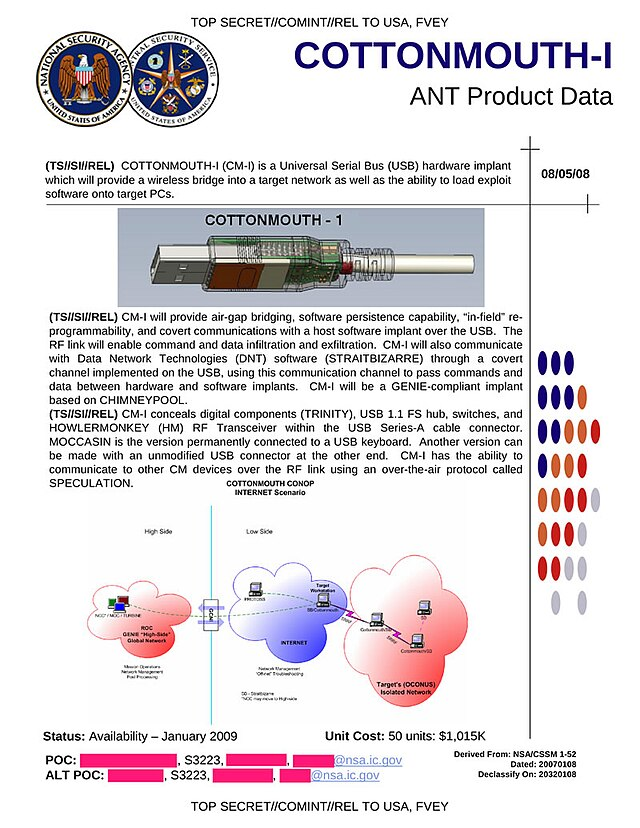
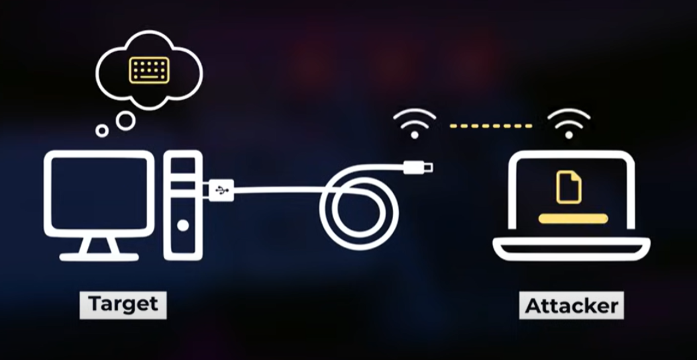
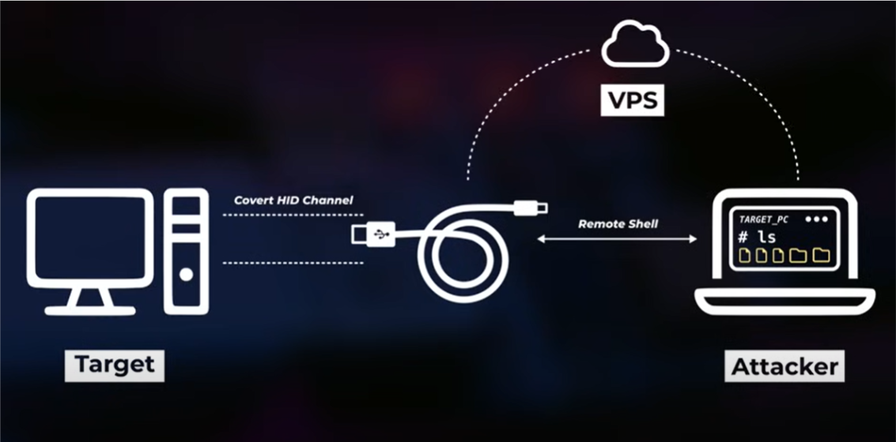
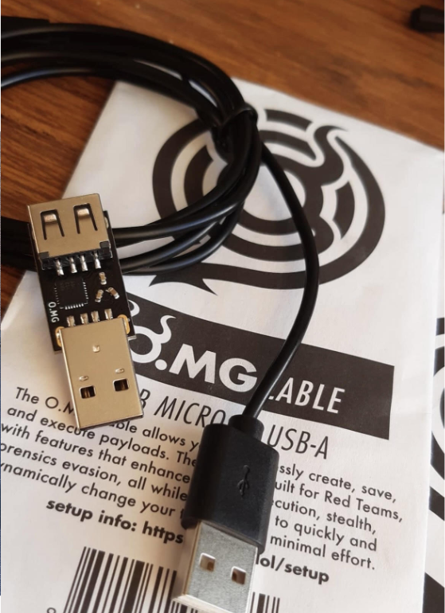

# OMG Cable: A Powerful Tool for Red Team Operations  

## Introduction  

The [OMG Cable](https://shop.hak5.org/products/omg-cable) is one of the most impressive cybersecurity tools available today. Initially inspired by the *COTTONMOUTH-I* project, it appears to be an ordinary charging cable. However, it conceals an embedded Wi-Fi-enabled chip that allows remote payload execution on a target system.  

It all started while I was at university, I liked exploring the tools of hak5. One day I saw the launch of this device and immediately started saving money to buy it, I was fascinated!
Despite having the first version which is quite limited compared to the current one, this is one of the first cybersecurity devices I bought, so it's special to me.
Its concept is similar to the well-known Rubber Ducky, requiring knowledge of _Ducky Script_ for effective operation.    

## How It Works  

Once connected to a computer, the OMG Cable is recognized as a human interface device (HID), such as a keyboard. This allows it to send keystroke-based payloads, executing commands as if they were typed by a legitimate user. Unlike traditional USB flash drive attacks—where awareness campaigns have made users cautious of inserting unknown drives—this attack vector is far more discreet. A simple charging cable does not raise the same level of suspicion.  

The OMG Cable creates a Wi-Fi connection, enabling remote access for payload execution. The attacker can control the device in real time, executing scripts to compromise the target system.  

## Evolution and Features  

Over the years, the OMG Cable has seen significant improvements. Initially, only three USB-A versions were available. Today, it supports various configurations, including USB-C to USB-C, making it even more versatile. Additionally, there are now two versions: the *Basic* and the *Elite*.  

Firmware updates have greatly enhanced its functionality. Older cables, such as mine, only support *Firmware Version 1*, which has a limited graphical interface and loses connection after executing a payload. In contrast, *Firmware Versions 2 and 3* offer a much more stable experience, with an improved interface and persistent connectivity.  

Firmware installation is done through the *OMG Programmer*. Previously, it required a standalone executable. Users can configure two Wi-Fi modes:  

- **Station Mode**: Connects the cable to an existing network.  
- **Access Point Mode**: Creates a dedicated Wi-Fi network for direct control.  

## HIDX: Stealth and Air-Gapped Attacks  

One of the most significant advancements came with the release of *Version 3* in late 2023, introducing [*HIDX StealthLink*](https://github.com/O-MG/O.MG-Firmware/wiki/HIDX-StealthLink). This feature allows for remote access and data exfiltration, even on air-gapped machines. Instead of using traditional network interfaces or external drives, it exploits raw HID communication channels, making detection much more difficult.  

## Implementation 
As a simple poc, I changed this [payload](https://payloadhub.com/blogs/payloads/windows-repair?_pos=1&_sid=d160a6ea0&_ss=r) to run on OMG-CABLE.Video [here](https://youtube.com/shorts/8Tw9N5yCq0M?si=AvyTGYA-3J1TtSvW).
)

## Alternative Tools  

While the OMG Cable is a must-have for Red Team professionals, its high cost makes self-made alternatives a viable option. There are several open-source projects available, and Hak5 previously offered an educational kit, though it is no longer sold.  

Other similar tools include:  

- **USB Ninja**: A slightly older project that remains functional but has seen little development in recent years. It still relies on USB-A connectors, making it less adaptable to modern devices.  
- **Flipper Zero (Bad USB Mode)**: While the Flipper Zero offers Bad USB functionality, it requires physical interaction to connect the device to a target system, making it more conspicuous.  

## Conclusion  

The OMG Cable has evolved into one of the most effective tools for Red Team engagements, offering a stealthy and efficient way to execute remote attacks. Its continuous firmware updates, improved hardware options, and powerful new features like *HIDX* make it an essential addition to any cybersecurity toolkit.  

For those looking for alternatives, DIY projects or older tools like USB Ninja may still serve a purpose, but the OMG Cable remains the most advanced option in its category.  

*For available payloads and further resources, available [here](https://payloadhub.com/blogs/payloads)* 

A simple way to protect yourself against this attack is to use a usb data blocker

