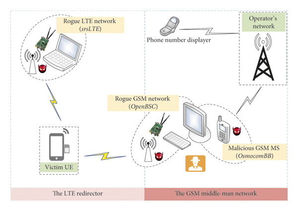
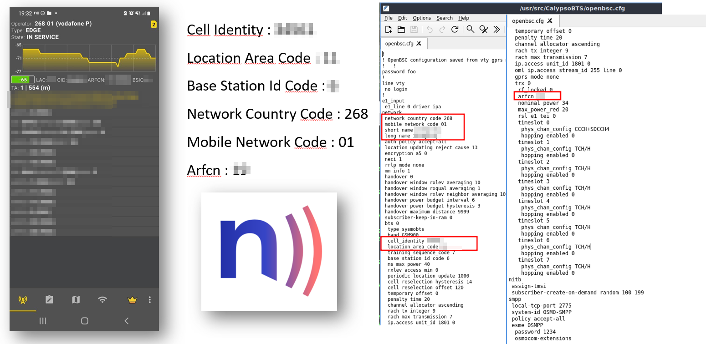
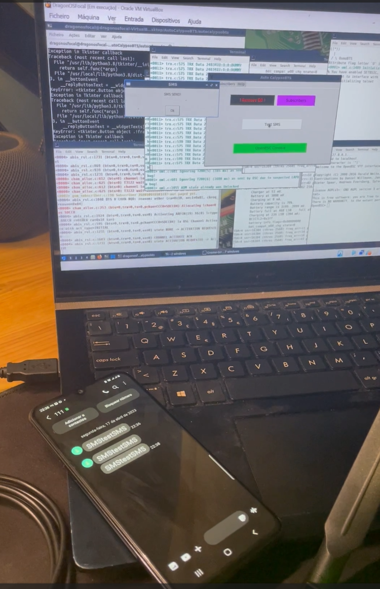

## Exploring 2G Network Implementation and Mobile Privacy Risks

### Introduction  
A few years ago, I began questioning whether it would be possible to scale an _International Mobile Subscriber Identity_ (IMSI) catcher application to identify the digital identity of individuals nearby. The goal was to capture phone numbers and correlate them with various leaked information sources.  
During this research, I came across an incredible paper that inspired my project: [*LTE Phone Number Catcher: A Practical Attack against Mobile Privacy*](https://onlinelibrary.wiley.com/doi/10.1155/2019/7425235). This article illustrates that mobile privacy remains vulnerable even in LTE networks as long as legacy GSM networks exist.

### Summary of LTE Phone Number Catcher  
The research highlighted that a mobile subscriber's phone number serves as a unique identifier in social networks. Unlike the IMSI, a phone number is never transmitted by the mobile device itself but may be shared when initiating a call or SMS.  
By leveraging an IMSI catcher and a 2G man-in-the-middle attack, the researchers developed a functional phone number catcher prototype for LTE phones. They demonstrated that once a device camped on their rogue station, they could capture its phone number within seconds. Furthermore, the study emphasized that anyone with basic programming skills and knowledge of GSM/LTE specifications could build a similar setup using _Software-defined radio_ (SDR) tools and commercial off-the-shelf equipment. The authors advocated for the global deactivation of GSM networks in areas covered by 3G and 4G to mitigate these risks.

### 2G Network Implementation  
Due to hardware limitations—specifically, having only a HackRF, which operates in half-duplex mode—I was unable to implement the phone number-catching attack. However, I gained valuable insights into [OSMOCOM BB](https://osmocom.org/projects/baseband) and decided to focus on building a 2G network instead.  
To achieve this, I acquired two Motorola C123 devices and two Sysmocom USB Serial Cable [CP2102](https://shop.sysmocom.de/Sysmocom-USB-serial-cable-CP2102-with-2.5mm-stereo-jack/cp2102-25) adapters. Initially, setting up a 2G network using OSMOCOM was complex due to my lack of experience. However, I discovered AutoCalypsoBTS, a project that significantly simplified the deployment process. Later, I refined my network setup using the [work](https://pl4y.readthedocs.io/en/latest/) of [Bastien Baranoff](https://github.com/bbaranoff), which I will detail in a future article.

### Overview of 2G Network Architecture  
GSM (2G) networks operate on a well-defined architecture consisting of:  
- **Base Transceiver Station (BTS):** Handles radio communication with mobile devices.  
- **Base Station Controller (BSC):** Manages multiple BTS units.  
- **Mobile Switching Center (MSC):** Connects calls and routes messages.  
- **Home Location Register (HLR) & Visitor Location Register (VLR):** Store subscriber information and track locations.  
A detailed discussion of mobile network architectures is beyond the scope of this paper. However, for a comprehensive overview of 2G, 3G, and 4G architectures, I recommend this insightful article: [Architecture of Mobile Networks (2G, 3G, 4G)](https://www.linkedin.com/pulse/architecture-mobile-networks-2g-3g-4g-ilyes-amokrane-lezzoum-tyofe/).

### Implementation of AutoCalypsoBTS  
As the operating system, I opted for [DragonOS](https://cemaxecuter.com/) because it already contains the stable OSMOCOM binaries.
The implementation of [AutoCalypsoBTS](https://github.com/jhonnybonny/AutoCalypsoBTS) was quite easy, you just need to configure the data for the antenna we're creating.
As a final step, I installed [NetMonitor](https://play.google.com/store/apps/details?id=com.parizene.netmonitor) on an Android device. This application provided advanced insights into 2G/3G/4G/5G networks, including:  
- Cell Identify (CID)  
- Local Area Code (LAC)  
- Base Station ID Code (BSIC)  
- Network Country Code (NCC)  
- Mobile Network Code (MNC)  
- Absolute Radio Frequency Channel Number (ARFCN)  

By collecting these details, I could simulate a nearby cell tower.Setting my smartphone to 2G mode ensured it connected only to my network.

### SMS Network Testing  
Once my device successfully connected to the 2G network, I used [Ozeki SMS Gateway](https://ozeki.hu/) to send spoofed messages within the network. This allowed me to test message injection capabilities by impersonating different entities or contacts.

### Learning Experience and Ethical Considerations  
When I started this project, I had zero experience of 2G networks. The entire endeavor was a learning process, heavily reliant on publicly available resources and tutorials from various YouTube creators. I strongly encourage others interested in security research to explore similar projects while adhering to ethical guidelines and legal frameworks.

### References
## References

- **Bastien Baranoff** - [Github](https://github.com/bbaranoff)  
- **Cemaxecuter** - [Youtube Channel](https://twitter.com/janesmith)  
- **Claremont Systems** - [Youtube Channel](https://www.youtube.com/@claremontsystems4255)  
- **Experiments LK** - [Youtube Channel](https://www.youtube.com/@experimentslk5291)  
- **JhonnyBonny** - [Github](https://github.com/companyxyz)  
- **Offensive Wireless** - [Youtube Channel](https://www.youtube.com/@offensivewireless)  
- **Super ben** - [Youtube Channel](https://www.youtube.com/@superben6483)  

  

  
